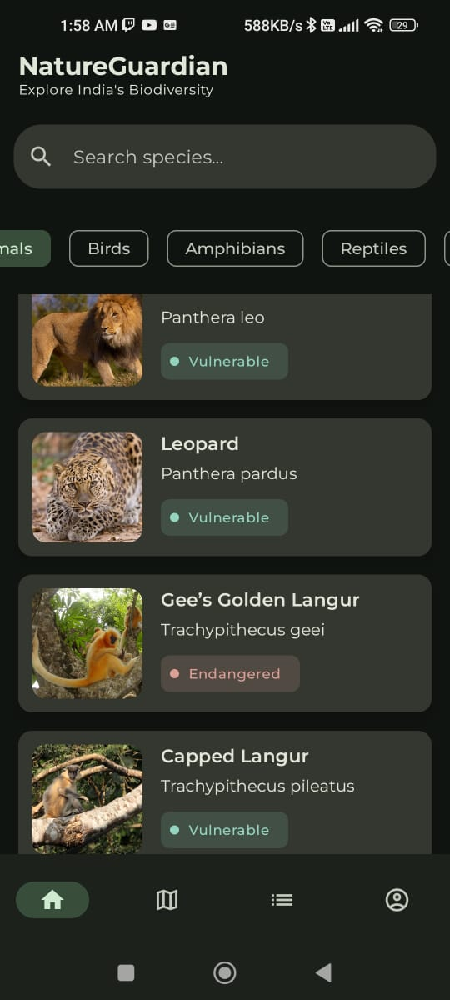
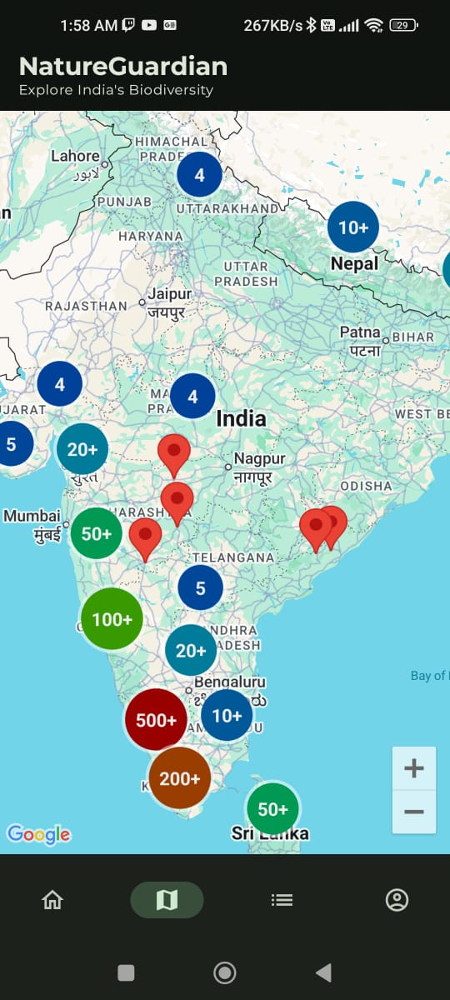
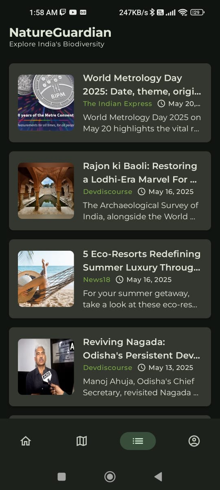
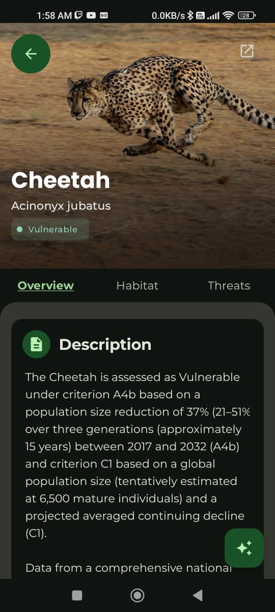
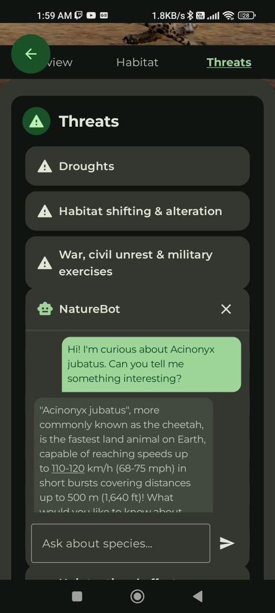

# 🌿 NatureGuardian

<p align="center">
  
</p>


**NatureGuardian** is an innovative Android app that raises awareness about India's rare,
endangered, and threatened (RET) species. Built with modern Android architecture and powered by
serverless cloud backends, it integrates AI-driven chat, real-time news, species mapping, and secure
media uploads to engage users in wildlife conservation.

> ⚠️ **Educational Demo Project**  
> This project is an open-source demo for educational purposes. The APK is for preview only. To run
> the app or deploy the backend, configure your own cloud credentials as detailed below.

---

## 🌟 Project Overview

**NatureGuardian** combines cutting-edge mobile development with cloud technologies to deliver an
educational tool for biodiversity conservation. Developed as a showcase of full-stack Android and
serverless expertise, it features:

- **Impactful Mission**: Promotes awareness of 200+ RET species in India.
- **Modern Tech Stack**: Leverages Jetpack Compose, AWS, Google Cloud, and AI APIs.
- **Scalable Architecture**: Uses serverless functions for news, notifications, and AI chat.
- **Portfolio Highlight**: Demonstrates proficiency in Android, cloud, and AI integration.

🔗 **Explore on GitHub
**: [adnanrangrej/nature-guardian](https://github.com/adnanrangrej/nature-guardian)  
📱 **Try the Demo APK
**: [Download v1.0-demo](https://github.com/adnanrangrej/nature-guardian/releases/download/v1.0-demo/app-release.apk)

---

## 📱 Key Features

| Feature                       | Description                                                                | Tech Stack                                       |
|-------------------------------|----------------------------------------------------------------------------|--------------------------------------------------|
| 🔎 **Species Profiles**       | Browse detailed profiles of 200+ species from a local CSV, stored in Room. | Jetpack Compose, Room                            |
| 🤖 **NatureBot AI**           | Interactive chatbot powered by Google Gemini for species-related queries.  | Google Gemini API, AWS Lambda (Python)           |
| 🗺️ **Species Maps**          | Visualize habitats with marker clustering on Google Maps.                  | Google Maps SDK, Jetpack Maps Compose            |
| 📰 **Real-Time News**         | Fetches conservation news every 15 minutes, stored in DynamoDB.            | AWS Lambda (Kotlin), GNews API, EventBridge      |
| 🔔 **Push Notifications**     | Sends updates via AWS SNS and Firebase Cloud Messaging.                    | AWS SNS, FCM                                     |
| 🧾 **Authentication & Media** | Secure login and profile image uploads to Cloudinary.                      | Firebase Auth, Cloudinary, Google Cloud Function |

---

## 📸 Screenshots & Demo

Dive into **NatureGuardian** with these vibrant screenshots showcasing the app’s core features! From
exploring endangered species to engaging with our AI-powered NatureBot, these glimpses highlight the
seamless user experience and rich functionality. For a complete gallery, visit
the [docs/screenshots/](docs/) directory, or check out our demo video below.

<div align="center">
  <table style="border-collapse: collapse; width: 100%; max-width: 800px;">
    <tr>
      <td align="center" style="padding: 10px;">
        
        <p><strong>Species List</strong><br>Browse 200+ rare species with rich profiles.</p>
      </td>
      <td align="center" style="padding: 10px;">
        
        <p><strong>Map View</strong><br>Visualize habitats with Google Maps clustering.</p>
      </td>
      <td align="center" style="padding: 10px;">
        
        <p><strong>News Feed</strong><br>Stay updated with real-time conservation news.</p>
      </td>
    </tr>
    <tr>
      <td align="center" style="padding: 10px;">
        
        <p><strong>Species Details</strong><br>Explore in-depth species information.</p>
      </td>
      <td align="center" style="padding: 10px;">
        
        <p><strong>NatureBot</strong><br>Chat with our AI about wildlife conservation.</p>
      </td>
    </tr>
  </table>
</div>

> 🌟 **Want to see more?** Check out the full screenshot gallery in [docs/screenshots/](docs/), or
> contribute your own screenshots and videos to enhance this section!
> See [Contributing](#contributing) for details.

---

## 📦 Demo APK

Experience **NatureGuardian** with our pre-built demo APK:

👉 **[Download Demo APK (v1.0-demo)](https://github.com/adnanrangrej/nature-guardian/releases/download/v1.0-demo/app-release.apk)**

**Notes**:

- Signed with a demo key for preview purposes.
- Connects to demo backend services, which may have rate limits or change.
- Enable "Install from Unknown Sources" on your Android device to install.

---

## 🏗️ Project Structure

```bash
NatureGuardian/
├── app/                            # Android app (Jetpack Compose, Kotlin)
├── backend/                        # AWS Lambda: Device registration & news notifier
├── apigateway/                     # AWS Lambda: News API from DynamoDB
├── cloudinarysignaturegenerator/   # Google Cloud Function: Cloudinary signatures
├── naturebot/                      # AWS Lambda: Gemini AI chatbot (Python)
└── docs/                           # Screenshots, diagrams, and gallery
```

### ☁️ Backend Services

| Service                     | Tech         | Purpose                                                         | Path                             |
|-----------------------------|--------------|-----------------------------------------------------------------|----------------------------------|
| NewsNotifierLambda          | Kotlin (AWS) | Fetches GNews articles, updates DynamoDB (EventBridge schedule) | `/backend/NewsNotifierLambda/`   |
| DeviceRegisterLambda        | Kotlin (AWS) | Registers devices to AWS SNS for notifications                  | `/backend/DeviceRegisterLambda/` |
| NewsApiLambda               | Kotlin (AWS) | API Gateway endpoint for news from DynamoDB                     | `/apigateway/NewsApiLambda/`     |
| CloudinarySignatureFunction | Kotlin (GCP) | Secure signatures for Cloudinary uploads (Google Cloud Run)     | `/cloudinarysignaturegenerator/` |
| NatureGuardianBotLambda     | Python (AWS) | AI chatbot powered by Google Gemini API                         | `/naturebot/`                    |

> 📚 Each service has a detailed `README.md` in its directory for setup and deployment.

---

## 🚀 Tech Stack

<p align="center">
  
  
  
  
  
</p>

- **Frontend**: Jetpack Compose, Kotlin, Jetpack Navigation, Coil
- **Backend**: AWS Lambda (Kotlin, Python), Google Cloud Functions (Kotlin)
- **Data**: Room (CSV import), Firebase Firestore, Amazon DynamoDB
- **APIs**: Google Gemini, GNews, Google Maps SDK, Cloudinary
- **Networking**: Retrofit, OkHttp
- **Notifications**: AWS SNS, Firebase Cloud Messaging
- **DI**: Hilt (Dagger)
- **Secrets**: Secrets Gradle Plugin

---

## 🛠️ Setup Instructions

To build **NatureGuardian** or deploy its backend, follow these steps:

1. **Clone the Repository**:
   ```bash
   git clone https://github.com/adnanrangrej/nature-guardian.git
   cd nature-guardian
   ```

2. **Android App Setup** (`app/`):
   - **Firebase**:
      - Create an Android project in [Firebase Console](https://console.firebase.google.com/).
      - Use package name `com.github.adnanrangrej.natureguardian`.
      - Place `google-services.json` in `app/`.
      - Enable Authentication (Email/Password) and Firestore.
   - **Secrets** (`app/secrets.properties`):
     ```properties
     MAPS_API_KEY=YOUR_MAPS_API_KEY
     BACKEND_BASE_URL=YOUR_NEWS_API_GATEWAY_URL
     CLOUDINARY_CLOUD_NAME=YOUR_CLOUDINARY_CLOUD_NAME
     CLOUDINARY_BACKEND_URL=YOUR_CLOUDINARY_FUNCTION_URL
     CLOUDINARY_BACKEND_URL_API_KEY=YOUR_CLOUDINARY_API_KEY
     ```
     Ensure `secrets.properties` is in `.gitignore`.
   - **Build**: Open in Android Studio, sync Gradle, and run.

3. **Backend Setup**:
   - Navigate to `backend/`, `apigateway/`, `cloudinarysignaturegenerator/`, or `naturebot/`.
   - Follow each `README.md` for deployment (AWS, Google Cloud, Cloudinary, Gemini API).
   - Required:
      - **AWS**: DynamoDB, SNS, API Gateway, EventBridge, IAM roles.
      - **Google Cloud**: Cloud Run for Cloudinary signatures.
      - **APIs**: GNews, Google Gemini, Cloudinary accounts.

---

## 📚 Backend Documentation

Detailed setup for each backend service:

- [NewsNotifierLambda](/backend/src/main/java/com/github/adnanrangrej/backend/newsnotifier/README.md)
- [DeviceRegisterLambda](/backend/src/main/java/com/github/adnanrangrej/backend/deviceregistration/README.md)
- [NewsApiLambda](/apigateway/src/main/java/com/github/adnanrangrej/apigateway/README.md)
- [CloudinarySignatureFunction](/cloudinarysignaturegenerator/src/main/java/com/github/adnanrangrej/cloudinarysignaturegenerator/README.md)
- [NatureGuardianBotLambda](/naturebot/README.md)

---

## 🙋 Limitations

- **Demo APK**: Signed with a demo key, not for production.
- **Costs**: AWS/Google Cloud services may incur usage-based charges.
- **Scope**: Educational demo, not fully production-hardened.
- **Security**: Secure API keys and credentials; avoid committing to Git.

---

## 🤝 Contributing

Join the **NatureGuardian** community! To contribute:
1. Fork the repository.
2. Create a feature branch (`git checkout -b feature/YourFeature`).
3. Commit changes (`git commit -m "Add YourFeature"`).
4. Push to the branch (`git push origin feature/YourFeature`).
5. Open a Pull Request.

Please include:

- Code adhering to project style.
- Updated documentation (e.g., new backend READMEs).
- Screenshots or videos for UI changes.

🌟 **Ideas**: Add new species, enhance NatureBot, or create a demo video!

---

## 📬 Contact & Portfolio

Connect with me to discuss **NatureGuardian** or collaboration opportunities:

- **LinkedIn**: [Md Adnan](https://www.linkedin.com/in/adnanrangrej/)
- **GitHub**: [adnanrangrej](https://github.com/adnanrangrej)
- **Email**: mdadnanrangrej@gmail.com

This project is a cornerstone of my portfolio, showcasing expertise in Android development, cloud
architecture, and AI integration. Feel free to reach out for code reviews or hiring inquiries!

---

## 📄 License

Licensed under the MIT License. See [LICENSE](LICENSE) for details.

MIT © 2025 Md Adnan